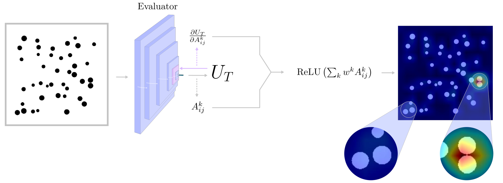

# Image Generation of Short Glass Fibre Composite Microstructures: from Control to Optimisation and Damage Prediction

<p align="center">
  
</p>


## Setup

1. Install requirements:
   ```
   pip install -r requirements.txt
   ```
2. Download the data folder at https://drive.google.com/file/d/1T4TYkr9lUn2qTKgyg9zG4nIAn9AjQGap/view?usp=sharing

3. Run training scripts:
   ```
   python training/train_predictor.py --dataset dataset_elastic
   python training/train_diffusion.py --mode elastic
   python training/train_cwgan.py
   python training/train_predictor.py --dataset dataset_damage
   ```

4. Run gradcam saver script to obtain the heatmaps:
   ```
   python gradcam/gradcam_saver.py --dataset dataset_elastic
   python gradcam/gradcam_saver.py --dataset dataset_damage
   ```

5. Run training script for damage diffusion:
   ```
   python training/train_diffusion.py --mode damage
   ```

## Structure

- `core/`: Core utilities and data handling modules.
- `models/`: Deep Learning Architectures.
- `gradcam/`: GradCAM utilities.
- `training/`: Training scripts for each experiment:
  - `train_diffusion.py`
  - `train_cwgan_elasticity.py`
  - `train_predictor.py`